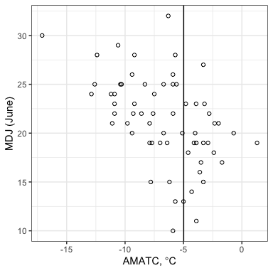
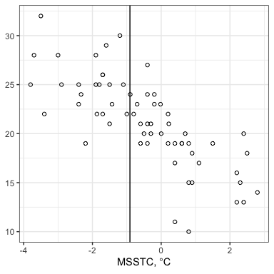
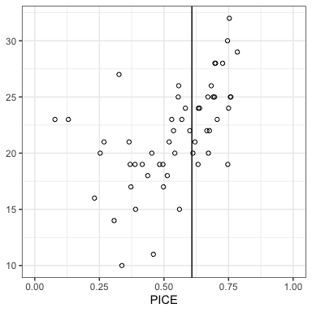
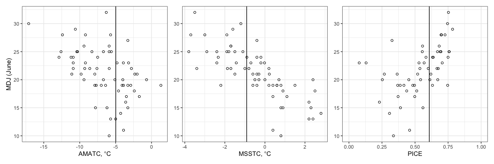
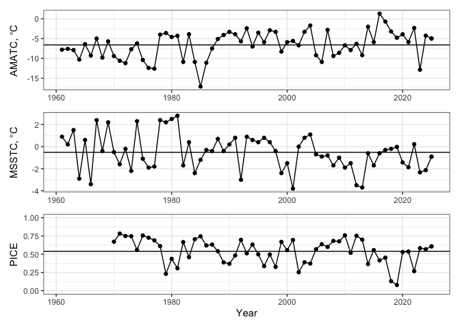
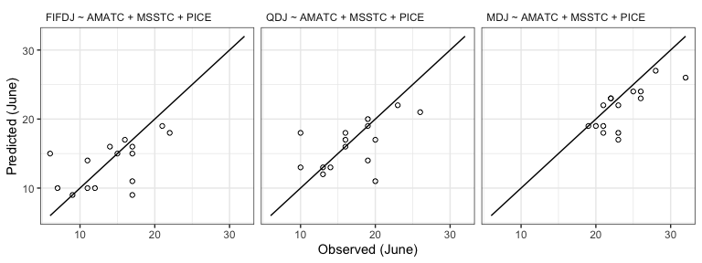
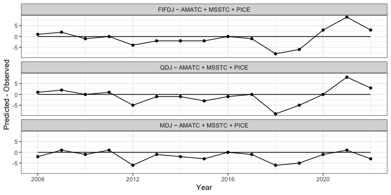
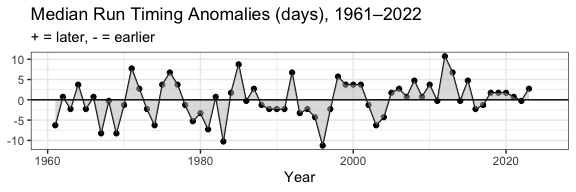

# 2025 Pre-Season Forecast


``` r
renv::activate()
```

``` r
library(knitr)
library(dplyr)
library(ggplot2)
library(readr)
library(patchwork)
library(ggtext)
```

``` r
forecast_year <- 2025
suppressWarnings({
  dir.create("./figures")
  dir.create("./output")
})
theme_set(theme_bw())
```

## Data

``` r
environment <- read_csv("../../data/data/environment/environment.csv")
cpue <- read_csv("../../data/data/cpue/cpue.csv")
yukon <- left_join(environment, cpue)
```

## Figures

### MDJ vs. AMATC

``` r
p_amatc <- ggplot(yukon, aes(amatc, mdj)) +
  geom_point(shape = 1) +
  geom_vline(xintercept = yukon[which(yukon$year == forecast_year), "amatc"][[1]]) +
  labs(x = expression("AMATC," * ~ degree * "C"), y = "MDJ (June)")

p_amatc
```



``` r
ggsave("./figures/mdj_against_amatc.png", width = 4, height = 4)
```

### MDJ vs. MSSTC

``` r
p_msstc <- ggplot(yukon, aes(msstc, mdj)) +
  geom_point(shape = 1) +
  geom_vline(xintercept = yukon[which(yukon$year == forecast_year), "msstc"][[1]]) +
  labs(x = expression("MSSTC," * ~ degree * "C"), y = NULL)

p_msstc
```



``` r
ggsave("./figures/mdj_against_msstc.png", width = 4, height = 4)
```

### MDJ vs. PICE

``` r
p_pice <- ggplot(yukon, aes(pice, mdj)) +
  geom_point(shape = 1) +
  geom_vline(xintercept = yukon[which(yukon$year == forecast_year), "pice"][[1]]) +
  scale_x_continuous(limits = c(0, 1.0)) +
  labs(
    x = "PICE",
    y = NULL)

p_pice
```



``` r
ggsave("./figures/mdj_against_pice.png", width = 4, height = 4)
```

### Combined

``` r
p_all <- p_amatc + p_msstc + p_pice
p_all
```



``` r
ggsave("./figures/three_panel.png", width = 9, height = 3)
```

### Time series of AMATC, MSSTC, PICE

``` r
p1 <- ggplot(yukon, aes(year, amatc)) +
  geom_line() +
  geom_point(data = subset(yukon, year == forecast_year)) +
  geom_hline(yintercept = mean(yukon[yukon$year < forecast_year, "amatc"][[1]])) +
  labs(y = expression("AMATC," * ~ degree * "C")) +
  theme(axis.title.x = element_blank())

p2 <- ggplot(yukon, aes(year, msstc)) +
  geom_line() +
  geom_point(data = subset(yukon, year == forecast_year)) +
  geom_hline(yintercept = mean(yukon[yukon$year < forecast_year, "msstc"][[1]])) +
  labs(y = expression("MSSTC," * ~ degree * "C")) +
  theme(axis.title.x = element_blank())

p3 <- ggplot(yukon, aes(year, pice)) +
  geom_line() +
  geom_point(data = subset(yukon, year == forecast_year)) +
  geom_hline(yintercept = mean(yukon[yukon$year < forecast_year, "pice"][[1]], na.rm = TRUE)) +
  scale_y_continuous(limits = c(0, 1)) +
  labs(
    x = "Year",
    y = "PICE"
  )
timeseries_3p <- p1 / p2 / p3
timeseries_3p
```



``` r
ggsave("./figures/timseries_3p.png", timeseries_3p, width = 8, height = 6)
```

## Modeling

### Model Selection

``` r
models <- c(
  "mdj ~ amatc",
  "mdj ~ msstc",
  "mdj ~ pice",
  "mdj ~ amatc + msstc",
  "mdj ~ amatc + pice",
  "mdj ~ msstc + pice",
  "mdj ~ amatc + msstc + pice"
)
models
```

    [1] "mdj ~ amatc"                "mdj ~ msstc"               
    [3] "mdj ~ pice"                 "mdj ~ amatc + msstc"       
    [5] "mdj ~ amatc + pice"         "mdj ~ msstc + pice"        
    [7] "mdj ~ amatc + msstc + pice"

# Set up selection

``` r
hindcast_window <- 15 # last n years
hindcast_years <- seq(forecast_year - hindcast_window, forecast_year - 1)
round_method <- floor # Floor predictions

hindcast_year <- function(data, model, forecast_year) {
  training_data <- data[data$year < forecast_year, ]
  training_model <- lm(formula(model), training_data)

  new_data <- data[data$year == forecast_year, ]
  prediction <- predict(training_model, newdata = new_data, se.fit = TRUE)
  prediction_fit <- round_method(prediction$fit[[1]])
  prediction_interval <- prediction_fit + c(-2, 2) * qnorm(0.975) *
    prediction$se.fit[[1]]

  # Extract response
  response_var = dimnames(attr(terms(as.formula(model)), "factors"))[[1]][1]
  actual <- new_data[[response_var]]

  in_interval <- actual >= round_method(prediction_interval[1]) &&
    actual <= round_method(prediction_interval[2])

  data.frame(
    "formula" = model,
    "year" = forecast_year,
    "predicted" = (prediction_fit),
    "observed" = actual,
    "diff" = prediction_fit - actual,
    "predict_se" = prediction$se.fit[[1]],
    "in_interval" = in_interval,
    "int_lower" = prediction_interval[1],
    "int_upper" = prediction_interval[2],
    "int_width" = prediction_interval[2] -
      prediction_interval[1]
  )
}

hindcast_model <- function(data, model, years, summarize = TRUE) {
  result <- lapply(years, function(year) {
    hindcast_year(data, model, year)
  })

  model_result <- do.call(rbind, result)

  if (!summarize) {
    return(model_result)
  }

  data.frame(
    model = model,
    "MAPE" = round(mean(abs(model_result$predicted - model_result$observed)), 2),
    "SDMAPE" = round(sd(abs(model_result$predicted - model_result$observed)), 2),
    "width" = round(mean(model_result$int_width), 2),
    "p.in" = round(sum(model_result$in_interval) / length(model_result$in_interval), 2),
    "absmax" = max(abs(model_result$predicted - model_result$observed)),
    "meanbias" = round(mean(model_result$predicted - model_result$observed), 2)
  )
}

hindcast_models <- function(data, models, years) {
  result <- lapply(models, function(model) {
    hindcast_model(data, model, years)
  })

  do.call(rbind, result)
}

model_selection_result <- hindcast_models(yukon, models, hindcast_years)
knitr::kable(model_selection_result)
```

| model                      | MAPE | SDMAPE | width | p.in | absmax | meanbias |
|:---------------------------|-----:|-------:|------:|-----:|-------:|---------:|
| mdj ~ amatc                | 4.20 |   2.86 |  6.26 | 0.47 |     12 |    -4.07 |
| mdj ~ msstc                | 1.60 |   1.50 |  4.39 | 0.67 |      5 |    -0.67 |
| mdj ~ pice                 | 3.67 |   3.48 |  6.62 | 0.60 |     11 |    -3.53 |
| mdj ~ amatc + msstc        | 2.33 |   1.72 |  5.86 | 0.67 |      7 |    -1.67 |
| mdj ~ amatc + pice         | 3.87 |   3.20 |  8.31 | 0.47 |     10 |    -3.73 |
| mdj ~ msstc + pice         | 2.20 |   2.21 |  7.00 | 0.80 |      7 |    -1.40 |
| mdj ~ amatc + msstc + pice | 2.27 |   1.94 |  8.21 | 0.87 |      6 |    -1.60 |

``` r
write.csv(model_selection_result, file = "./output/model_select.csv")
```

### 15%

``` r
model_fifdj <- lm(fifdj ~ amatc + msstc + pice, data = subset(yukon, year < forecast_year))
summary(model_fifdj)
```


    Call:
    lm(formula = fifdj ~ amatc + msstc + pice, data = subset(yukon, 
        year < forecast_year))

    Residuals:
        Min      1Q  Median      3Q     Max 
    -9.2630 -2.2695  0.4032  2.1583  6.4563 

    Coefficients:
                Estimate Std. Error t value Pr(>|t|)    
    (Intercept)   8.9766     1.7287   5.193 3.81e-06 ***
    amatc        -0.5774     0.1693  -3.411 0.001290 ** 
    msstc        -1.3310     0.3709  -3.588 0.000756 ***
    pice          0.7387     3.9179   0.189 0.851209    
    ---
    Signif. codes:  0 '***' 0.001 '**' 0.01 '*' 0.05 '.' 0.1 ' ' 1

    Residual standard error: 3.4 on 50 degrees of freedom
      (9 observations deleted due to missingness)
    Multiple R-squared:  0.5474,    Adjusted R-squared:  0.5202 
    F-statistic: 20.16 on 3 and 50 DF,  p-value: 1.065e-08

``` r
prediction_fifdj <- floor(predict(model_fifdj, newdata = yukon[yukon$year == forecast_year, ]))
```

### 25%

``` r
model_qdj <- lm(qdj ~ amatc + msstc + pice, data = subset(yukon, year < forecast_year))
summary(model_qdj)
```


    Call:
    lm(formula = qdj ~ amatc + msstc + pice, data = subset(yukon, 
        year < forecast_year))

    Residuals:
        Min      1Q  Median      3Q     Max 
    -8.0734 -1.8937  0.2076  1.7164  6.6837 

    Coefficients:
                Estimate Std. Error t value Pr(>|t|)    
    (Intercept)  11.6811     1.6376   7.133 3.72e-09 ***
    amatc        -0.4564     0.1604  -2.846   0.0064 ** 
    msstc        -1.5227     0.3514  -4.334 7.08e-05 ***
    pice          1.5955     3.7114   0.430   0.6691    
    ---
    Signif. codes:  0 '***' 0.001 '**' 0.01 '*' 0.05 '.' 0.1 ' ' 1

    Residual standard error: 3.221 on 50 degrees of freedom
      (9 observations deleted due to missingness)
    Multiple R-squared:  0.5743,    Adjusted R-squared:  0.5488 
    F-statistic: 22.49 on 3 and 50 DF,  p-value: 2.346e-09

``` r
prediction_qdj <- floor(predict(model_qdj, newdata = yukon[yukon$year == forecast_year, ]))
```

### 50%

``` r
model_mdj <- lm(mdj ~ amatc + msstc + pice, data = subset(yukon, year < forecast_year))
summary(model_mdj)
```


    Call:
    lm(formula = mdj ~ amatc + msstc + pice, data = subset(yukon, 
        year < forecast_year))

    Residuals:
        Min      1Q  Median      3Q     Max 
    -8.7758 -1.3693  0.2373  1.7350  6.6742 

    Coefficients:
                Estimate Std. Error t value Pr(>|t|)    
    (Intercept)  18.4330     1.5118  12.192  < 2e-16 ***
    amatc        -0.2490     0.1480  -1.682   0.0987 .  
    msstc        -1.8407     0.3244  -5.674 6.99e-07 ***
    pice          1.0267     3.4264   0.300   0.7657    
    ---
    Signif. codes:  0 '***' 0.001 '**' 0.01 '*' 0.05 '.' 0.1 ' ' 1

    Residual standard error: 2.974 on 50 degrees of freedom
      (9 observations deleted due to missingness)
    Multiple R-squared:  0.5904,    Adjusted R-squared:  0.5659 
    F-statistic: 24.03 on 3 and 50 DF,  p-value: 9.061e-10

``` r
prediction_mdj <- floor(predict(model_mdj, newdata = yukon[yukon$year == forecast_year, ]))
```

``` r
predictions <- data.frame(
  percentile = c("fifdj", "qdj", "mdj"),
  prediction = as.integer(c(
    prediction_fifdj,
    prediction_qdj,
    prediction_mdj
  ))
)
write_csv(predictions, file = "./output/predictions.csv")
kable(predictions)
```

| percentile | prediction |
|:-----------|-----------:|
| fifdj      |         14 |
| qdj        |         17 |
| mdj        |         23 |

# Historical Comparisons

## Long Term Means

``` r
long_term_means <- data.frame(
  variable = c("AMATC", "MSSTC", "PICE", "FIFDJ", "QDJ", "MDJ"),
  current_year_value = c(
    mean(yukon$amatc[which(yukon$year == forecast_year)]),
    mean(yukon$msstc[which(yukon$year == forecast_year)]),
    mean(yukon$pice[which(yukon$year == forecast_year)], na.rm = TRUE),
    mean(yukon$fifdj[which(yukon$year == forecast_year)]),
    mean(yukon$qdj[which(yukon$year == forecast_year)]),
    mean(yukon$mdj[which(yukon$year == forecast_year)])

  ),
  long_term_mean = c(
    mean(yukon$amatc[which(yukon$year < forecast_year)]),
    mean(yukon$msstc[which(yukon$year < forecast_year)]),
    mean(yukon$pice[which(yukon$year < forecast_year)], na.rm = TRUE),
    mean(yukon$fifdj[which(yukon$year < forecast_year)]),
    mean(yukon$qdj[which(yukon$year < forecast_year)]),
    mean(yukon$mdj[which(yukon$year < forecast_year)])

  )
)
long_term_means$cur_minus_ltm <- long_term_means$current_year_value - long_term_means$long_term_mean
long_term_means$range <- c(
  paste(range(yukon$amatc[which(yukon$year < forecast_year)]), collapse = " to "),
  paste(range(yukon$msstc[which(yukon$year < forecast_year)]), collapse = " to "),
  paste(range(yukon$pice[which(yukon$year < forecast_year)], na.rm = TRUE), collapse = " to "),
  paste(range(yukon$fifdj[which(yukon$year < forecast_year)]), collapse = " to "),
  paste(range(yukon$qdj[which(yukon$year < forecast_year)]), collapse = " to "),
  paste(range(yukon$mdj[which(yukon$year < forecast_year)]), collapse = " to ")

)
kable(long_term_means)
```

| variable | current_year_value | long_term_mean | cur_minus_ltm | range          |
|:---------|-------------------:|---------------:|--------------:|:---------------|
| AMATC    |             -4.260 |     -6.6368254 |     2.3768254 | -17.1 to 1.3   |
| MSSTC    |             -2.130 |     -0.4909365 |    -1.6390635 | -3.8 to 2.8    |
| PICE     |              0.569 |      0.5395741 |     0.0294259 | 0.078 to 0.784 |
| FIFDJ    |                 NA |     13.7936508 |            NA | 5 to 23        |
| QDJ      |                 NA |     16.1587302 |            NA | 6 to 26        |
| MDJ      |                 NA |     21.2698413 |            NA | 10 to 32       |

``` r
long_term_timing_means <- data.frame(
  fifdj = mean(yukon$fifdj, na.rm = TRUE),
  qdj = mean(yukon$qdj, na.rm = TRUE),
  mdj = mean(yukon$mdj, na.rm = TRUE))
kable(long_term_timing_means)
```

|    fifdj |      qdj |      mdj |
|---------:|---------:|---------:|
| 13.79365 | 16.15873 | 21.26984 |

## Hindcast all three models

``` r
hindcast_fifdj <- hindcast_model(yukon, "fifdj ~ amatc + msstc + pice", hindcast_years)
hindcast_qdj <- hindcast_model(yukon, "qdj ~ amatc + msstc + pice", hindcast_years)
hindcast_mdj <- hindcast_model(yukon, "mdj ~ amatc + msstc + pice", hindcast_years)

hindcast_all_percentiles <- rbind(
  hindcast_fifdj,
  hindcast_qdj,
  hindcast_mdj)
write_csv(hindcast_all_percentiles, "output/hindcast_all_models.csv")
kable(hindcast_all_percentiles)
```

| model                        | MAPE | SDMAPE | width | p.in | absmax | meanbias |
|:-----------------------------|-----:|-------:|------:|-----:|-------:|---------:|
| fifdj ~ amatc + msstc + pice | 3.13 |   2.70 |  8.37 | 0.87 |      9 |    -0.33 |
| qdj ~ amatc + msstc + pice   | 2.93 |   2.89 |  7.84 | 0.73 |      9 |    -0.40 |
| mdj ~ amatc + msstc + pice   | 2.27 |   1.94 |  8.21 | 0.87 |      6 |    -1.60 |

``` r
hindcast_models <- c(
  "fifdj ~ amatc + msstc + pice",
  "qdj ~ amatc + msstc + pice",
  "mdj ~ amatc + msstc + pice"
)
hindcast <- do.call(rbind, lapply(hindcast_models, function(model) {
  hindcast_model(yukon, model, hindcast_years, summarize = FALSE)

}))

hindcast$formula <- toupper(hindcast$formula)
hindcast$formula <- ordered(hindcast$formula, c(
  "FIFDJ ~ AMATC + MSSTC + PICE",
  "QDJ ~ AMATC + MSSTC + PICE",
  "MDJ ~ AMATC + MSSTC + PICE"
))
predicted_vs_observed <- ggplot(hindcast, aes(observed, predicted)) +
  geom_point(shape = 1) +
  scale_shape_manual(values = c(1, 19)) +
  facet_wrap(~ formula) +
  annotate(
    geom = "segment",
    x = min(c(hindcast$observed, hindcast$predicted)),
    y = min(c(hindcast$observed, hindcast$predicted)),
    xend = max(c(hindcast$observed, hindcast$predicted)),
    yend = max(c(hindcast$observed, hindcast$predicted))
  ) +
  labs(
    x = "Observed (June)",
    y = "Predicted (June)"  ) +
  theme(strip.background = element_rect(fill=NA, colour=NA),
        strip.text = element_text(hjust = 0))

ggsave("figures/predicted_vs_observed.png",
  predicted_vs_observed,
  width = 8,
  height = 3
)
predicted_vs_observed
```



``` r
forecast_timeseries <- ggplot(hindcast, aes(year, diff)) +
  geom_line() +
  geom_point() +
  facet_wrap(~ formula, ncol = 1) +
  annotate(geom = "segment", x = min(hindcast$year), xend = max(hindcast$year), y = 0, yend = 0) +
  labs(
    x = "Year",
    y = "Predicted - Observed"
  )
forecast_timeseries
```



## Long-term summaries

### Median dates over time

``` r
yukon <- yukon %>% mutate(diff = mdj - mean(mdj, na.rm = TRUE))
ggplot(data = yukon, aes(year, diff)) +
  geom_line() +
  geom_point() +
  geom_ribbon(aes(ymin = 0, ymax = diff), fill = "gray", alpha = 0.5) +
  geom_hline(yintercept=0) +
  xlab("Year") +
  ylab(NULL) +
  ggtitle("Median Run Timing Anomalies (days), 1961–2022",
          subtitle = "+ = later, - = earlier")
```


